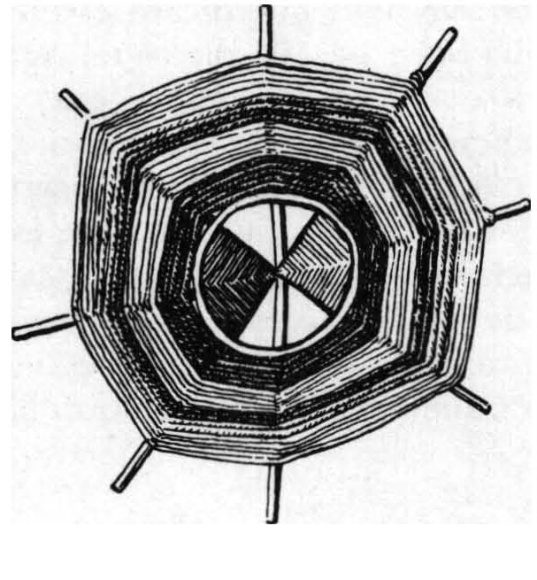
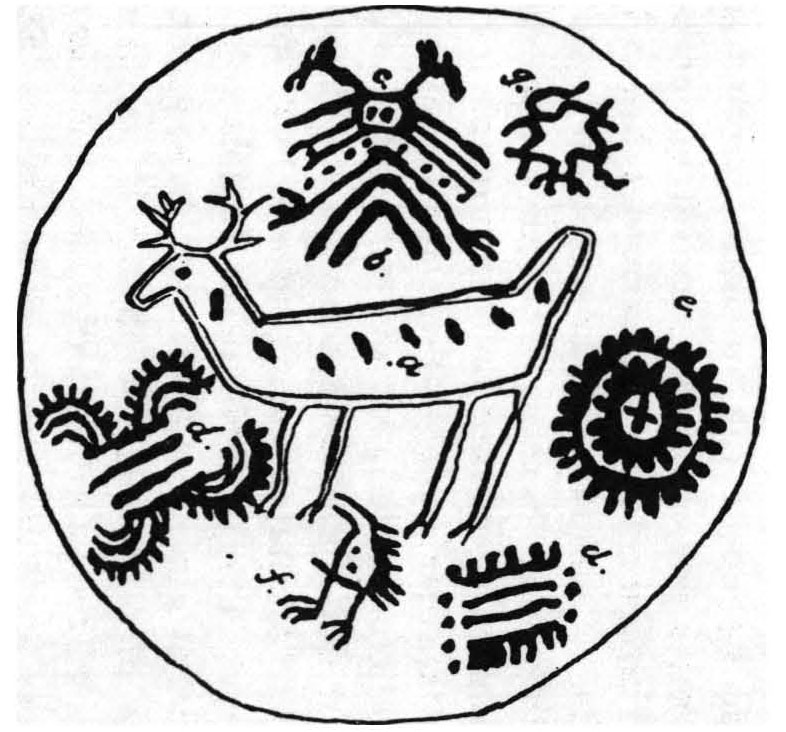

# Venadito Cósmico, MontePython data repository
#### A five-parameter Dark Energy Parameterization 

Venadito cósmico is a flexible equation-of-state (EoS) w(z) and w(a) that tries to parametrize the behavior of Dark Energy at close and medium redshifts. The equation can be expanded from a 2-parameter eq. to a 5 parameter eq. and is also reducible to Lambda-CDM model (i.e. w=-1). It is to be tested using CLASS + MontePython codes using BAO, SNa, H(z) and Planck datasets.

Check out the whole work and description of this parametrization [here](https://github.com/ClaudioNahmad/venadito-cosmico)!

This is a work in progress.
